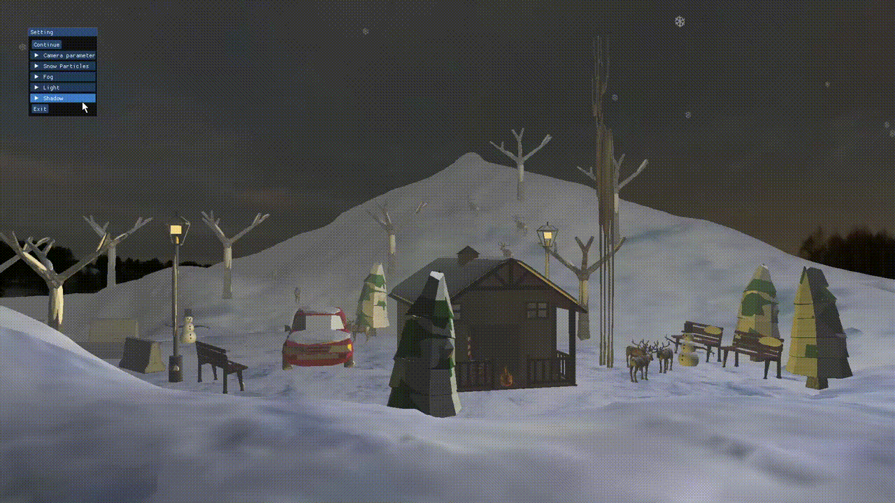
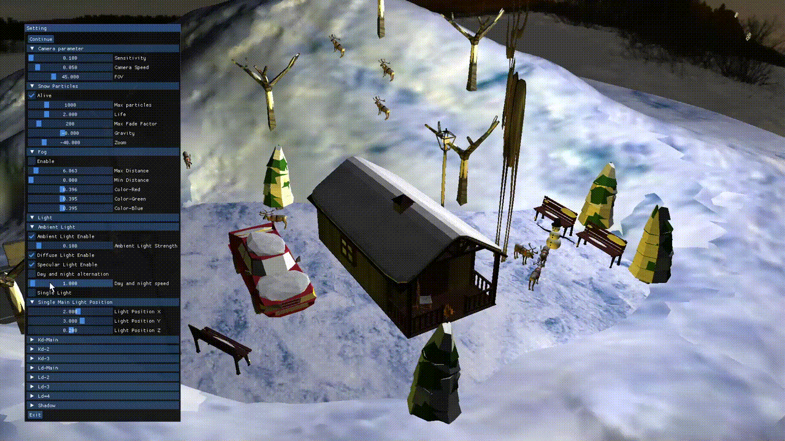

# 得分点

## 基础要求

- [x] 三维场景绘制
- [x] 简单的光照
- [x] 纹理映射
- [x] 透视投影

## 探索创新

- [x] 多个光源和物体不同材质的光照效果
- [ ] 高级纹理映射( ? ) like 法线贴图，视差贴图
- [x] 鼠标和键盘交互
- [x] 菜单控制(Imgui)
- [x] 雾效(Fog Effect)
- [x] 天空盒(Sky Box)
- [x] 粒子效果(Particle Effect)
- [ ] 点阴影
- [x] 昼夜交替

# 项目结构

- 📁 Debug (生成exe文件夹)
- 📁 envir (环境配置文件夹)
- 📁 models (模型文件夹)
- 📁 skybox (天空盒文件夹)
- 📄 b_frag.frag (光源片段着色器)
- 📄 b_vert.vert (光源顶点着色器)
- 📄 box_fragment.frag (天空盒片段着色器)
- 📄 box_shader.vert (天空盒顶点着色器)
- 📄 FragmentS1.frag (主渲染片段着色器)
- 📄 VertexS.vert (主渲染顶点着色器)
- 📄 GUI.cpp/GUI.h (imgui - 菜单实现)
- 📄 imgui\*\*.cpp/imgui\*\*.h (imgui - 组件库)
- 📄 Input.cpp/Input.h (键盘鼠标处理实现)
- 📄 main.cpp (主函数)
- 📄 Mesh.h (网格体实现)
- 📄 Model.h (模型加载类实现)
- 📄 Particles.cpp/Particles.h (粒子系统实现)
- ~~📄 shadow.frag (点阴影片段着色器实现)~~
- ~~📄 shadow.geom (点阴影几何着色器实现)~~
- ~~📄 shadow.vert (点阴影顶点着色器实现)~~
- 📄 stb_image.h (stb组件库)
- 📄 Practice_f.sln (Visual Studio项目文件)

# 功能展示

## GUI



## Fog


## Skybox


## Particles


## Multi-Light



## Day night alternation


# 探索创新功能具体实现

### Fog 雾效

**修改片段着色器**

首先，计算相机位置 `PosRelativeToCam` 与片元位置的距离 `dist`
接下来，通过将 `dist` 与雾的最大距离 `fog_maxdist` 和最小距离 `fog_mindist` 进行插值计算
然后，使用 `clamp` 函数将雾效因子限制在范围 `[0, 1]` 内
最后根据雾效因子 `fog_factor` 对最终的片元颜色进行插值，从而实现雾效的融合

```c
//FOG FACTOR CALCULATION
float dist = length(PosRelativeToCam.xyz); 
float fog_factor = (fog_maxdist - dist) / (fog_maxdist - fog_mindist);
fog_factor = clamp(fog_factor, 0.0, 1.0);
if (fog_display) FragColor = mix(fog_colour,FragColor,fog_factor);
```

## Skybox 天空盒

```c++
float skyboxVertices[] = {
	// 天空盒顶点坐标
	// 坐标值基于投影的最大值，此处为100
	-12.0f,  12.0f, -12.0f,
	-12.0f, -12.0f, -12.0f,
	 12.0f, -12.0f, -12.0f,
	 12.0f, -12.0f, -12.0f,
	 12.0f,  12.0f, -12.0f,
	-12.0f,  12.0f, -12.0f,

	-12.0f, -12.0f,  12.0f,
	-12.0f, -12.0f, -12.0f,
	-12.0f,  12.0f, -12.0f,
	-12.0f,  12.0f, -12.0f,
	-12.0f,  12.0f,  12.0f,
	-12.0f, -12.0f,  12.0f,

	 12.0f, -12.0f, -12.0f,
	 12.0f, -12.0f,  12.0f,
	 12.0f,  12.0f,  12.0f,
	 12.0f,  12.0f,  12.0f,
	 12.0f,  12.0f, -12.0f,
	 12.0f, -12.0f, -12.0f,

	-12.0f, -12.0f,  12.0f,
	-12.0f,  12.0f,  12.0f,
	 12.0f,  12.0f,  12.0f,
	 12.0f,  12.0f,  12.0f,
	 12.0f, -12.0f,  12.0f,
	-12.0f, -12.0f,  12.0f,

	-12.0f,  12.0f, -12.0f,
	 12.0f,  12.0f, -12.0f,
	 12.0f,  12.0f,  12.0f,
	 12.0f,  12.0f,  12.0f,
	-12.0f,  12.0f,  12.0f,
	-12.0f,  12.0f, -12.0f,

	-12.0f, -12.0f, -12.0f,
	-12.0f, -12.0f,  12.0f,
	 12.0f, -12.0f, -12.0f,
	 12.0f, -12.0f, -12.0f,
	-12.0f, -12.0f,  12.0f,
	 12.0f, -12.0f,  12.0f
};
```

```c++
// 天空盒纹理图像路径
vector<std::string> faces
{

	"..\\skybox\\posx.jpg",
	"..\\skybox\\negx.jpg",
	"..\\skybox\\posy.jpg",
	"..\\skybox\\negy.jpg",
	"..\\skybox\\posz.jpg",
	"..\\skybox\\negz.jpg"
};
```

```c
// Skybox vertex Shader
#version 330 core
layout (location = 0) in vec3 aPos;

out vec3 TexCoords;

uniform mat4 projection;
uniform mat4 view;

void main()
{
    TexCoords = aPos;
    vec4 pos = projection * view * vec4(aPos, 1.0);
    gl_Position = pos.xyww;
}
```

```c
//Skybox fragment shader
#version 330 core
out vec4 FragColor;

in vec3 TexCoords;

uniform samplerCube skybox;

void main()
{    
    FragColor = texture(skybox, TexCoords);
}
```

### Particles 粒子效果

```c++
typedef struct {
	// 生命
	bool alive;   // 粒子存活状态
	float life;   // 粒子的寿命
	float fade;   // 粒子衰减速度
	// 颜色
	float red;
	float green;
	float blue;
	// 位置
	float xpos;
	float ypos;
	float zpos;
	// 速度，只在y方向上运动
	float vel;
	// 重力
	float gravity;
}particles;
```

```c++
// 初始化雪花粒子
void createParticles();

// 为单个粒子重新初始化
void respawnByIndex(int index);

// 更新粒子
void updateParticles();

// 绘制下雪场景
void drawSnow();
```

```c++
// 初始化雪花粒子
void createParticles() {
	particles temp;
	temp.alive = particles_alive;
	temp.life = particles_life;
	temp.fade = float(rand() % particles_fadeMax) / 1000.0f + 0.003f;
	temp.xpos = (float)(rand() % 20) - 10;
	temp.ypos = 8.0;
	temp.zpos = (float)(rand() % 10) + 35;
	temp.red = 0.5;
	temp.green = 0.5;
	temp.blue = 1.0;
	temp.vel = 0.0;
	temp.gravity = particles_gravity; // 重力加速度

	for (int i = 0;i < MAX_PARTICLES;i++) {
		par_sys.push_back(temp);
	}

}
```

```c++
// 绘制下落的雪花并更新其位置
void drawSnow() {
	float x, y, z;
	for (int loop = 0; loop < par_sys.size(); loop = loop + 2) {
		if (par_sys[loop].alive == true) {
			x = par_sys[loop].xpos;
			y = par_sys[loop].ypos;
			z = par_sys[loop].zpos + zoom;

			// 将摄像机位置、投影矩阵、视图矩阵和模型矩阵传递给着色器，并使用指定的着色器绘制模型
			ptr1->setVec3("viewPos", cameraPos);
			glm::mat4 projection = glm::perspective(glm::radians(fov), (float)window_width / (float)window_height, 0.1f, 100.0f);
			ptr1->setMat4("projection", projection);
			glm::mat4 view = glm::lookAt(cameraPos, cameraPos + cameraFront, cameraUp);
			ptr1->setMat4("view", view);
			glm::mat4 model = glm::mat4(1.0f);
			model = glm::translate(model, glm::vec3(x, y, z));
			model = glm::scale(model, glm::vec3(1.0f / 1000));
			ptr1->setMat4("model", model);
			ptr6->Draw(ptr1);


			// 更新粒子的位置
			// 移动
			par_sys[loop].ypos += par_sys[loop].vel / (particles_slowdown * 1000);
			par_sys[loop].vel += par_sys[loop].gravity;
			// 衰变
			par_sys[loop].life -= par_sys[loop].fade;

			// 如果粒子掉出了视野范围，重新生成一个新的雪花粒子
			if (par_sys[loop].ypos <= -10) {
				par_sys[loop].life = -1.0;
			}

			// 如果粒子寿命结束，重新生成一个新的雪花粒子 
			if (par_sys[loop].life < 0.0) {
				respawnByIndex(loop);
			}
		}
	}
}
```

```c++
// 为单个粒子重新初始化
void respawnByIndex(int index) {
	par_sys[index].alive = particles_alive;
	par_sys[index].life = particles_life;
	par_sys[index].fade = float(rand() % particles_fadeMax) / 1000.0f + 0.003f;
	par_sys[index].xpos = (float)(rand() % 20) - 10;
	par_sys[index].ypos = 8.0;
	par_sys[index].zpos = (float)(rand() % 10) + 35;
	par_sys[index].red = 0.5;
	par_sys[index].green = 0.5;
	par_sys[index].blue = 1.0;
	par_sys[index].vel = 0.0;
	par_sys[index].gravity = particles_gravity; // 重力加速度
}
```

