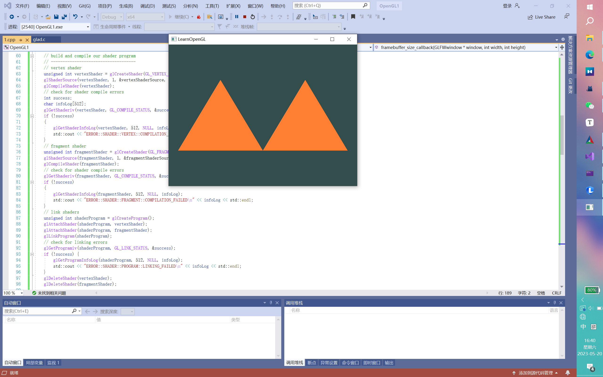
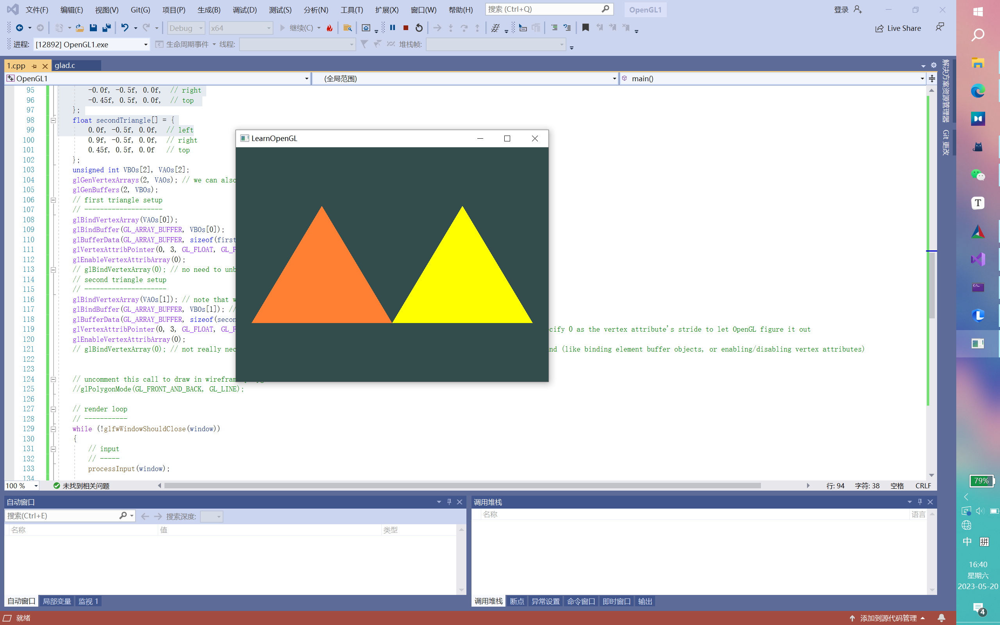
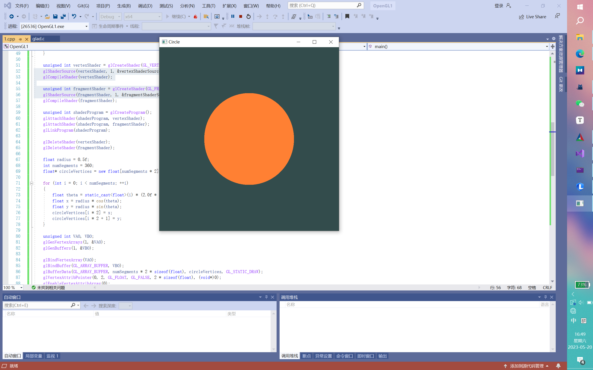
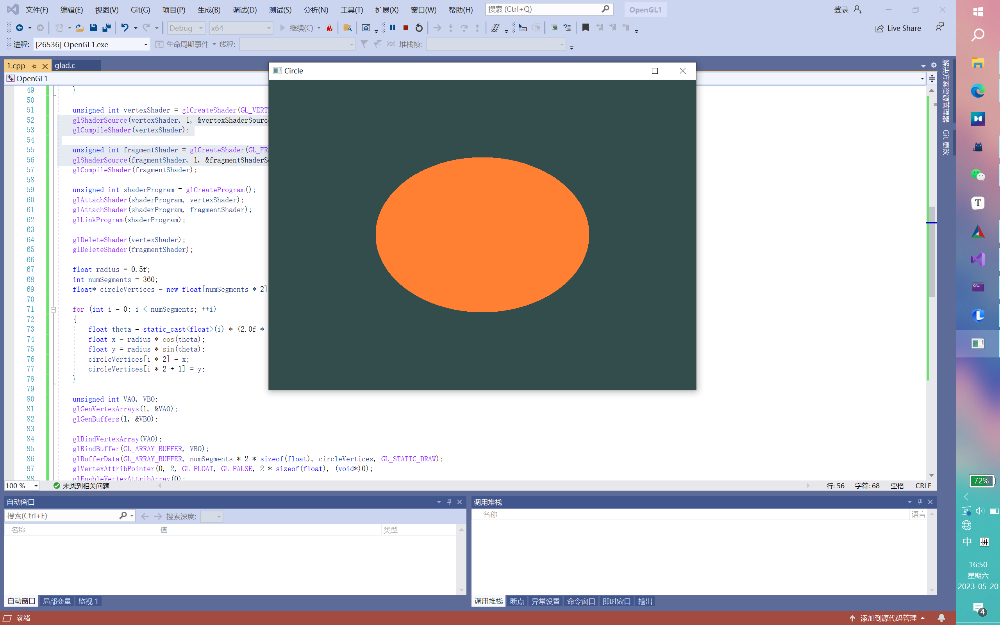
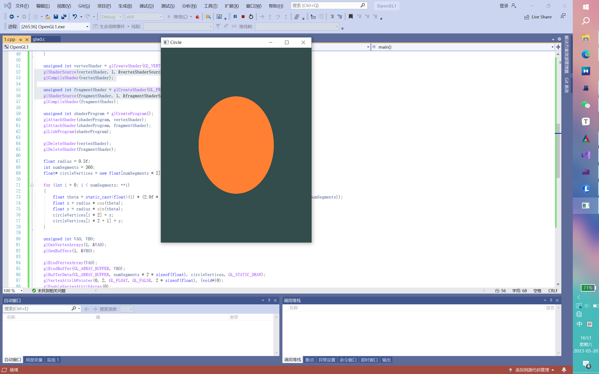

# 绘制两个彼此相连的三角形

*调用了glDrawArrays(GL_TRIANGLES, 0, 6)来绘制这6个顶点*

•第一个三角形的顶点位置是 (-0.9f, -0.5f, 0.0f), (-0.0f, -0.5f, 0.0f), (-0.45f, 0.5f, 0.0f)

•第二个三角形的顶点位置是 (0.0f, -0.5f, 0.0f), (0.9f, -0.5f, 0.0f), (0.45f, 0.5f, 0.0f)。



让其中一个输出为黄色

•使用了两个着色器程序和两个独立的VAO来绘制两个三角形

•每个三角形使用不同的着色器程序和顶点数据。



# 绘制一个圆

•使用了三角扇形（GL_TRIANGLE_FAN）绘制方法。

•通过计算生成了一个圆形的顶点数据数组circleVertices，该数组包含了圆形边界上的顶点坐标。然后将该数组通过glBufferData函数传递给顶点缓冲对象(VBO)

•使用glDrawArrays(GL_TRIANGLE_FAN, 0, numSegments)来绘制圆形，其中numSegments表示圆形的边界上的顶点数量。)。

```C++
    // 创建圆形顶点数据
    float radius = 0.5f;
    int numSegments = 360;
    //有横纵坐标所以要×2
    float* circleVertices = new float[numSegments * 2];

    for (int i = 0; i < numSegments; ++i)
    {
        // 计算当前顶点在圆上的角度 i/360 * 2pi
        float theta = static_cast<float>(i) * (2.0f * static_cast<float>(3.14159265358979323846) / static_cast<float>(numSegments));
        // 计算当前顶点的 x 和 y 坐标  轴坐标系
        float x = radius * cos(theta);
        float y = radius * sin(theta);
        // 将顶点坐标存入数组
        circleVertices[i * 2] = x;
        circleVertices[i * 2 + 1] = y;
    }
```



但是圆的比例会随窗口的变化而变化，这是因为我们使用了OpenGL的视口(Viewport)来定义渲染的区域。在窗口大小发生变化时，我们会调用`framebuffer_size_callback`函数来设置视口的大小，确保它与窗口的新大小匹配。

当视口的大小发生变化时，OpenGL会自动调整渲染的区域，以适应新的视口大小。这意味着绘制的图形将会自动进行缩放和拉伸，以填充整个视口。因此，圆的形状也会相应地进行缩放和拉伸，以适应新的窗口大小。





主要流程

1.  初始化GLFW，并创建一个窗口。
2.  设置OpenGL上下文和窗口回调函数。
3. 使用GLAD加载OpenGL函数指针。
4. 创建顶点着色器和片段着色器，并编译它们。
5. 创建着色器程序，并将顶点着色器和片段着色器附加到着色器程序上。
6.  创建一个包含圆形顶点数据的顶点数组对象（VAO）和顶点缓冲对象（VBO）。
7.  在渲染循环中，清除屏幕，使用着色器程序和VAO绘制圆形。
8.  处理输入事件并交换缓冲区。
9. 绘制圆形的关键是在初始化阶段计算出圆形的顶点位置，并存储在circleVertices数组中。在渲染循环中，使用GL_TRIANGLE_FAN绘制这些顶点，以形成一个圆形。