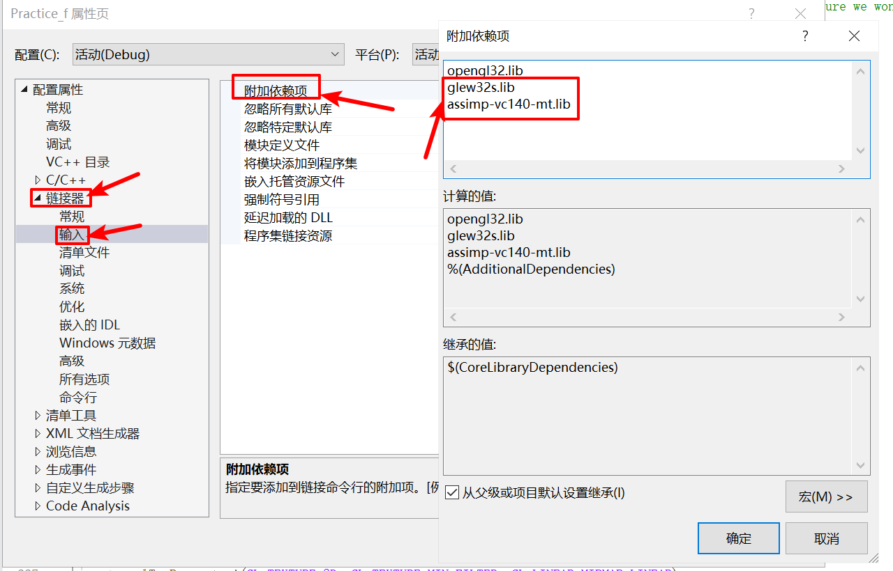

将`include`文件夹的东西放到你的编译器的`include`中

将`lib`文件夹里的东西放到编译器对应的`lib`中，注意`x86`和`x64`放到对应的位置

将`.dll`文件放在你生成的`.exe`同目录下

注意要把`model`和`skybox`以及编译好的`.frag`和`.vert`着色器文件放到编译好exe的上级目录里

在`Visual Studio`中要添加那两个lib

